# Manual de usuario - AHG CONSTRUFERRET POS

Version 3.0 - agosto de 2026

Este manual explica la operación completa del POS publicado con Vercel y Supabase. Las capturas fueron tomadas de la versión productiva actual. Los documentos fiscales y pagos se procesan únicamente en ambientes de prueba del proyecto académico.

## 1. Portada, acceso y pantalla principal

Abre `https://ahg-construferret-pos.vercel.app/`. Si no existe una sesión activa, el sistema muestra una portada pública que presenta las funciones principales de la plataforma.

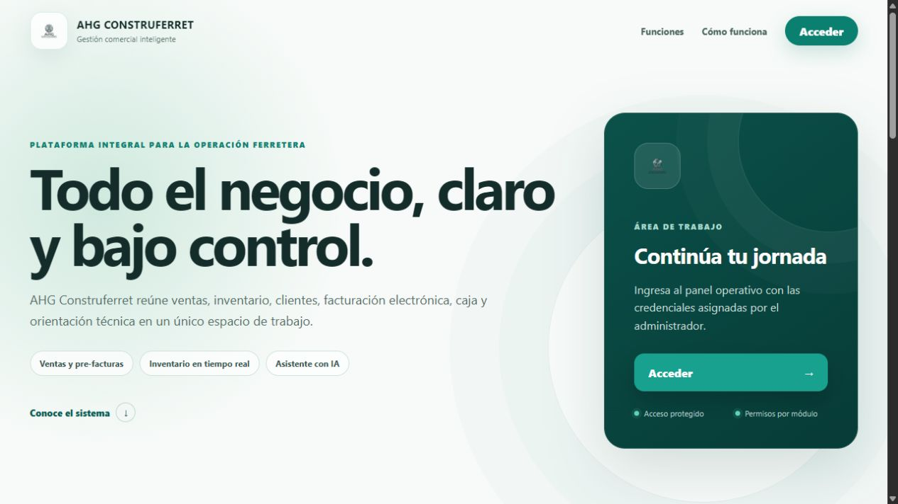

En la portada puedes:

- leer el resumen general del sistema;
- consultar sus módulos y el flujo operativo;
- desplazarte mediante **Funciones** y **Cómo funciona**;
- pulsar **Acceder**, en la parte superior o en la tarjeta derecha.

Al pulsar **Acceder** se abre el formulario seguro sobre la misma página. Escribe el correo o teléfono y la contraseña asignada por el administrador. Puedes cerrar el formulario con la **X**, haciendo clic fuera de la tarjeta o pulsando `Esc`.

Después de autenticarte se abre **Inicio**, no el mostrador de venta.

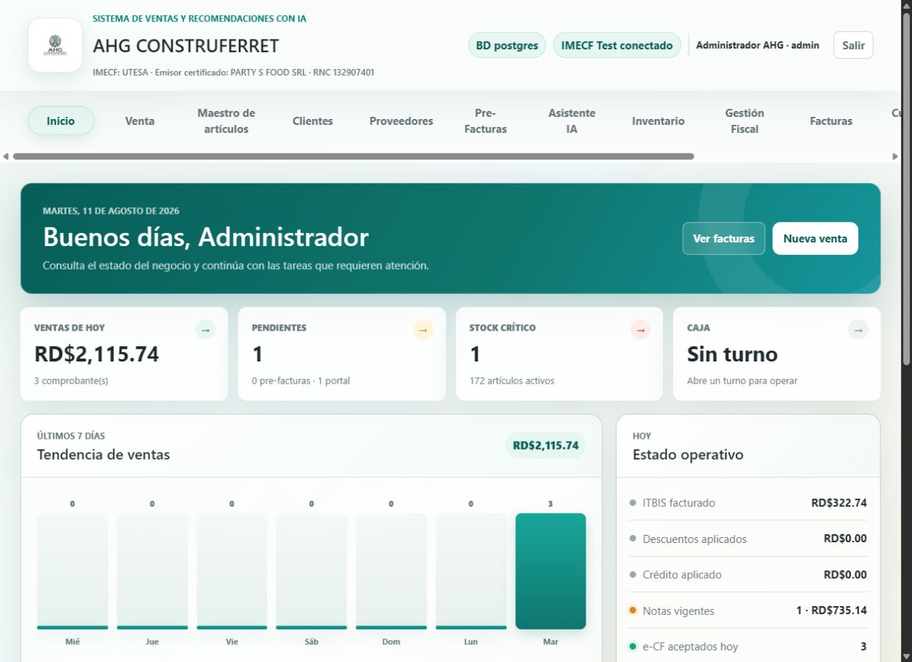

El dashboard resume:

- **Ventas de hoy:** monto total y cantidad de comprobantes.
- **Pendientes:** pre-facturas internas y solicitudes del portal Customer.
- **Stock crítico:** artículos cuyo stock alcanzó o bajó del mínimo.
- **Caja:** estado del turno y efectivo esperado.
- **Tendencia de ventas:** total diario de los últimos siete días.
- **Estado operativo:** ITBIS, descuentos, crédito aplicado, notas vigentes y estado fiscal.
- **Últimos comprobantes:** documentos recientes con cliente, total y estado.
- **Productos vendidos hoy:** clasificación por cantidad.
- **Accesos rápidos:** solo aparecen módulos autorizados para el usuario.

Pulsa una tarjeta o acceso rápido para abrir el módulo correspondiente. **Salir** cierra la sesión.

## 2. Venta y pre-factura

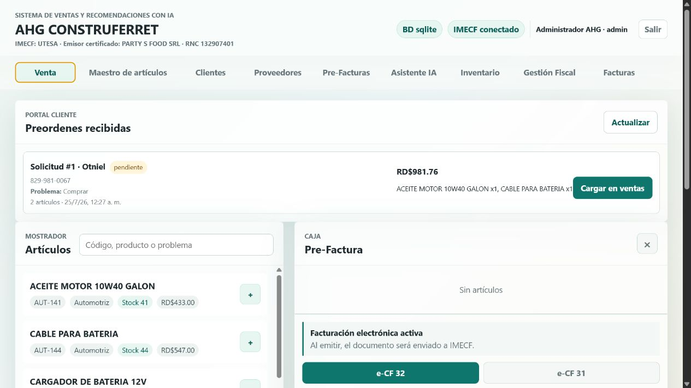

### Crear una venta

1. Abre **Venta** desde el menú o desde **Nueva venta** en el dashboard.
2. Busca por nombre, SKU, código de barras o necesidad.
3. Pulsa **+** para agregar el artículo.
4. Ajusta cantidad, precio autorizado y descuento por línea.
5. Selecciona **e-CF 32** para consumidor final o **e-CF 31** para crédito fiscal.
6. Selecciona un cliente registrado o completa los datos permitidos.
7. Elige la forma de pago.
8. Si corresponde, agrega descuento general y nota interna.
9. Pulsa **Guardar pre-factura** para dejarla pendiente o **Emitir comprobante de prueba** para facturar.

### Solicitudes del portal Customer

En **Preordenes recibidas**:

- **Actualizar** consulta nuevas solicitudes.
- **Vista previa** muestra cliente, comentario, artículos y total sin llenar el carrito.
- **Cargar en ventas** copia los artículos y datos al mostrador.
- **Eliminar** borra una solicitud que no será procesada.

La solicitud del portal no descuenta inventario hasta emitir la venta.

## 3. Notas de crédito vigentes y pagos combinados

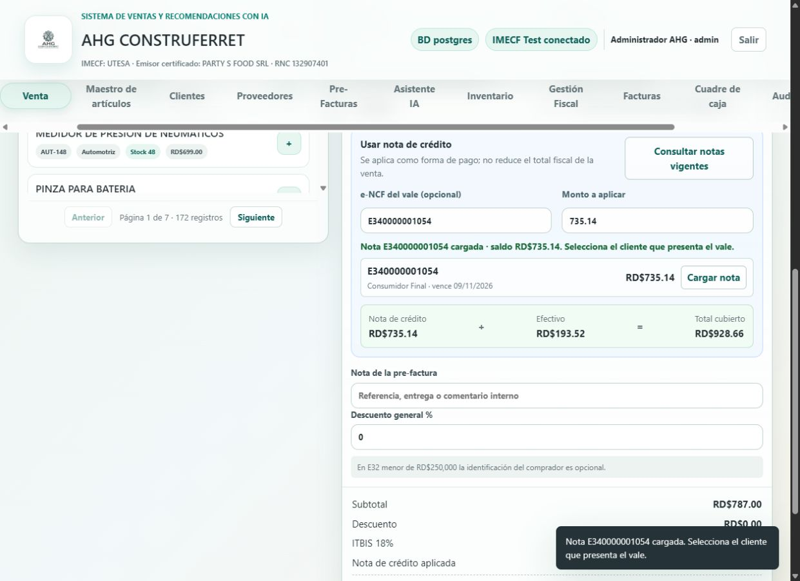

### Consultar y cargar una nota

1. Agrega los productos de la nueva compra.
2. En **Usar nota de crédito**, pulsa **Consultar notas vigentes**.
3. Revisa e-NCF, cliente de origen, vencimiento y saldo.
4. Pulsa **Cargar nota**.
5. Si la nota pertenece a un cliente registrado, el sistema lo selecciona.
6. Si indica **Consumidor Final**, selecciona el cliente que presenta el vale.
7. Modifica **Monto a aplicar** si no deseas consumir el saldo completo.

El cuadro de plan de pago muestra automáticamente:

`Nota de crédito + forma de pago del monto restante = total cubierto`

### Nota más otro medio de pago

No actives **Dividir saldo restante** para el caso normal de dos formas totales. Solo carga la nota y elige **Efectivo**, **Tarjeta**, **Transferencia** o **PayPal** como forma del monto restante.

Ejemplo: nota RD$735.14 + efectivo RD$193.52 = total RD$928.66.

Activa **Dividir saldo restante** únicamente cuando, además de la nota, dividirás lo pendiente entre dos medios adicionales, por ejemplo nota + efectivo + tarjeta.

La nota no reduce el total fiscal del documento: se registra como forma de pago. Solo reduce el monto que el cliente debe entregar.

## 4. Pagos con dos medios sin nota

1. En **Pago**, selecciona el primer medio.
2. Activa **Pago con dos formas**.
3. Escribe el monto de la primera forma.
4. Selecciona la segunda forma.
5. El sistema calcula el monto restante.
6. Verifica que ambos importes sean mayores que cero.
7. Si uno es tarjeta o PayPal, completa la pasarela de prueba antes de emitir.

Los dos medios deben cubrir exactamente el monto a cobrar.

## 5. Maestro de artículos

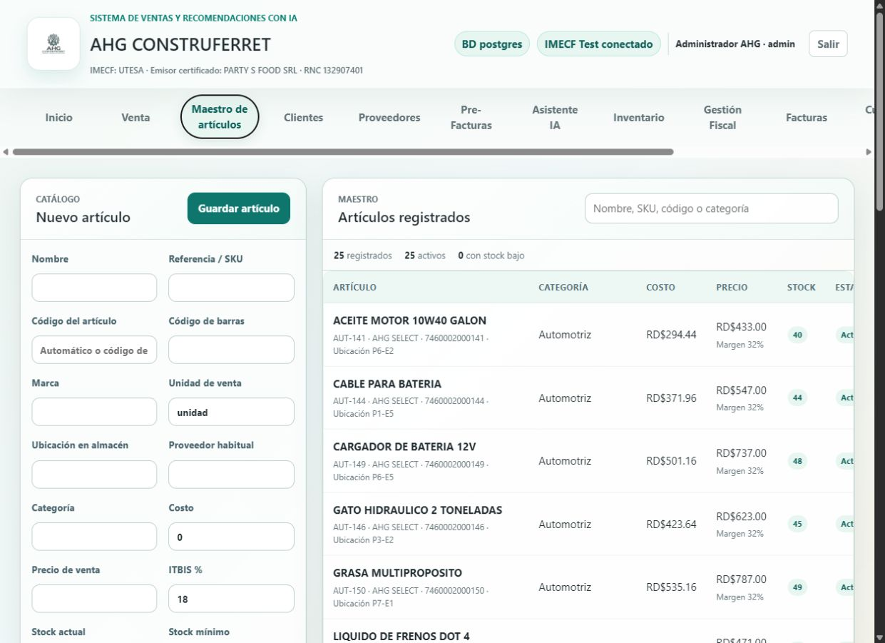

### Crear un artículo

1. Abre **Maestro de artículos**.
2. Completa SKU, código de barras, nombre y categoría.
3. Registra descripción técnica, marca, unidad, ubicación y proveedor.
4. Define costo, precio, ITBIS, stock y stock mínimo.
5. Mantén marcada la casilla de artículo activo.
6. Pulsa **Guardar artículo**.

### Editar o desactivar

Usa el buscador y pulsa **Editar**. Guarda los cambios después de revisar precio e inventario. Para conservar historial, desactiva el artículo en lugar de borrarlo.

Cada cambio de existencia genera un movimiento de inventario.

## 6. Clientes

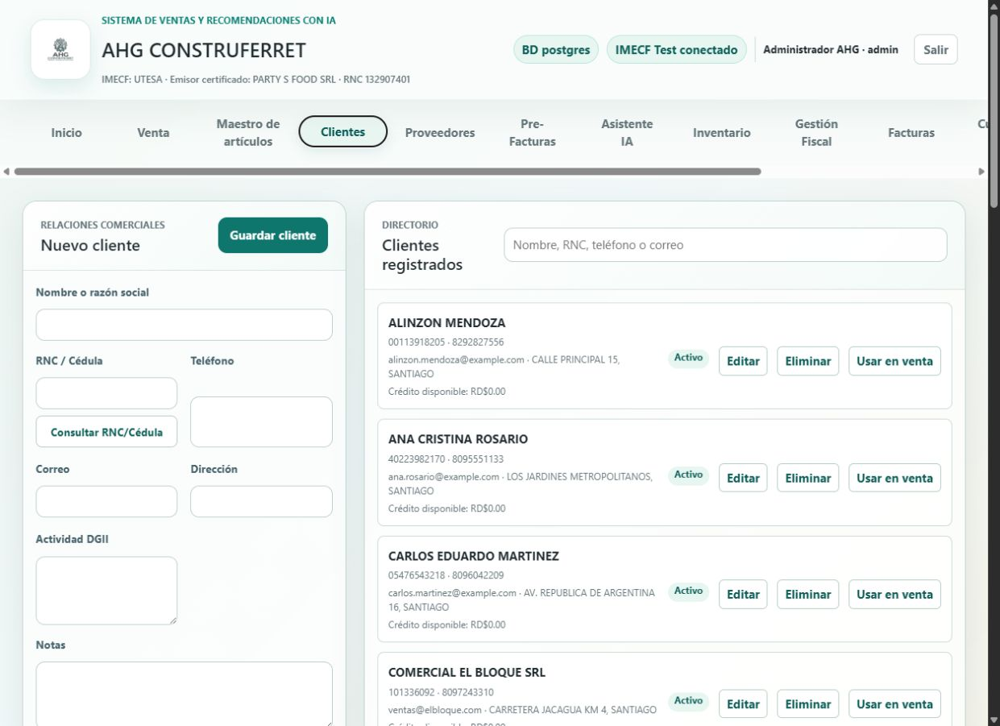

1. Abre **Clientes**.
2. Escribe RNC o cédula y usa **Consultar** cuando corresponda.
3. Verifica nombre, teléfono, correo, dirección y actividad.
4. Pulsa **Guardar cliente**.

En el directorio:

- **Editar** carga el registro en el formulario.
- **Usar en venta** lo selecciona en el mostrador.
- **Eliminar** lo retira cuando las relaciones existentes lo permiten.

Evita duplicar clientes y confirma el RNC antes de emitir un e-CF 31.

## 7. Proveedores

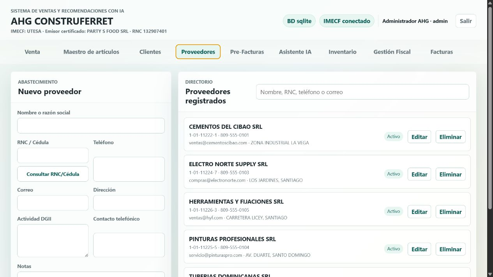

Registra razón social, RNC, contacto, teléfono, correo, dirección, actividad y notas. Usa **Editar** para mantener el registro y **Eliminar** cuando ya no se utilice. Los proveedores activos aparecen al recibir mercancía en **Compras**.

### Compras y cuentas por pagar

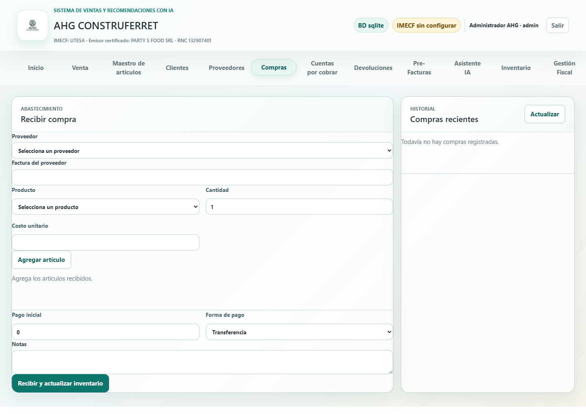

1. Abre **Compras** y selecciona el proveedor.
2. Indica la factura del proveedor.
3. Agrega cada producto con la cantidad y el costo unitario recibido.
4. Registra el pago inicial y su forma; deja el monto en cero si queda totalmente pendiente.
5. Pulsa **Recibir y actualizar inventario**.

El sistema aumenta las existencias, calcula el costo promedio ponderado y conserva el balance. Usa **Registrar pago** en el historial para amortizar una cuenta pendiente. Los pagos en efectivo exigen una caja abierta y se descuentan del efectivo esperado.

### Cuentas por cobrar

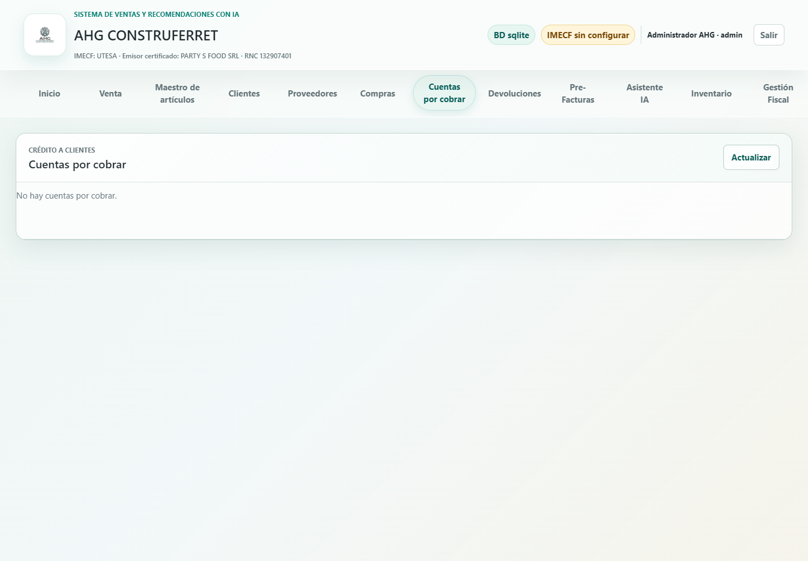

Al elegir **Crédito** en Venta, selecciona un cliente y confirma la fecha de vencimiento. La factura crea una cuenta por cobrar por el saldo completo. En **Cuentas por cobrar**, pulsa **Registrar cobro**, indica el monto y la forma de pago. Los cobros en efectivo exigen caja abierta y se suman al cuadre.

### Devoluciones parciales y totales

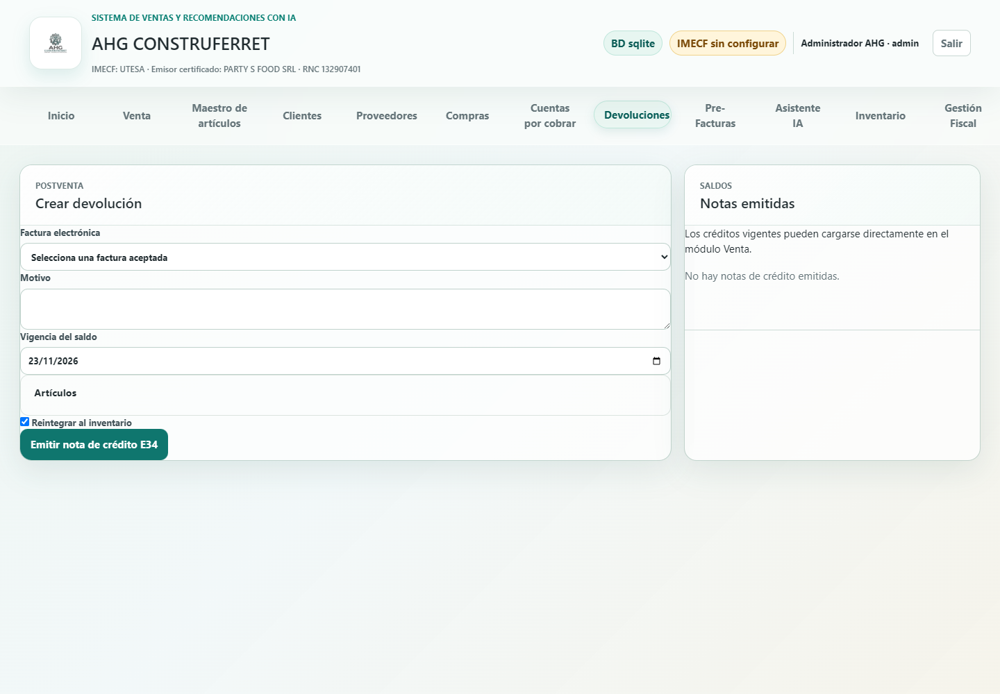

1. Abre **Devoluciones** y selecciona una factura electrónica aceptada.
2. Escribe el motivo y la vigencia comercial del saldo.
3. Marca los artículos y cantidades que regresan; no es necesario devolver la factura completa.
4. Conserva marcada la reposición si los artículos vuelven al inventario.
5. Emite el E34 y consulta el saldo en la lista de notas.

El sistema impide devolver más unidades que las vendidas, aun cuando existan varias devoluciones parciales sobre la misma factura.

## 8. Pre-facturas

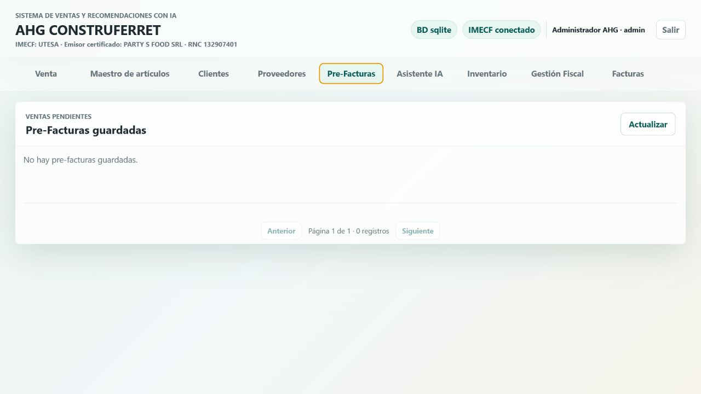

En **Pre-Facturas** se reúnen los borradores creados en el POS.

1. Busca por cliente, referencia o estado.
2. Pulsa **Abrir** o **Revisar** para inspeccionar el contenido.
3. Usa **Cargar en ventas** para completar o modificar la operación.
4. Verifica stock, precios, descuentos, cliente, e-CF y pago.
5. Emite únicamente después de confirmar toda la información.

La paginación evita cargar el historial completo en una sola consulta.

## 9. Asistente IA local

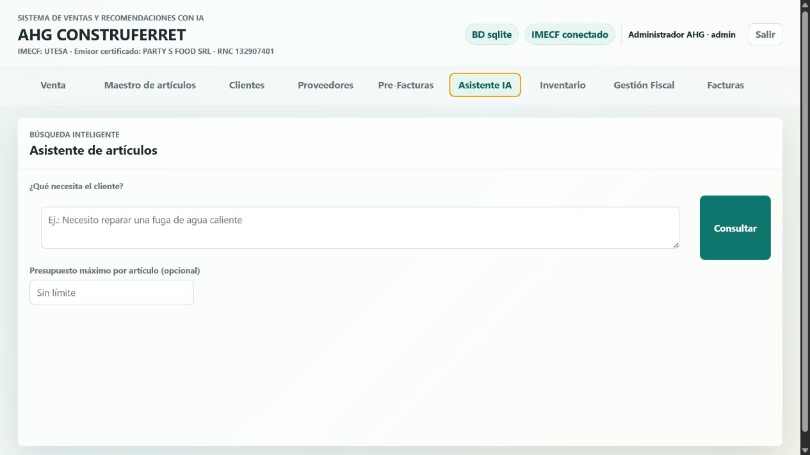

1. Abre **Asistente IA**.
2. Describe el trabajo o problema.
3. Incluye material, medida, ubicación, cantidad y presupuesto cuando los conozcas.
4. Pulsa **Analizar necesidad**.
5. Responde preguntas de seguimiento.
6. Revisa coincidencia, uso sugerido, precio y existencia.
7. Agrega al carrito solamente los artículos confirmados.

El motor consulta productos activos y disponibles. La recomendación es orientativa y debe ser validada por el vendedor o técnico.

## 10. Inventario

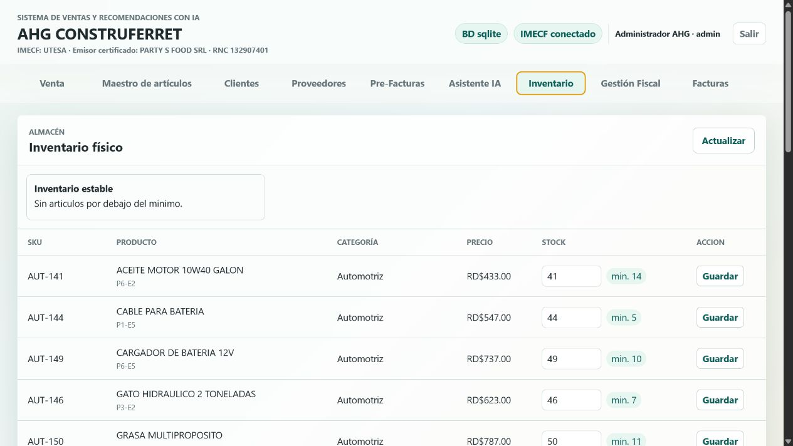

**Stock crítico** identifica artículos por debajo del mínimo. Desde el módulo se revisan cantidades y se corrigen existencias mediante el maestro de artículos.

Buenas prácticas:

- Registra entradas por recepción de mercancía.
- Registra salidas por merma o ajuste autorizado.
- Escribe una referencia o motivo comprensible.
- Compara periódicamente el sistema con el conteo físico.
- Revisa el dashboard después de cada ajuste importante.

## 11. Gestión Fiscal e IMECF

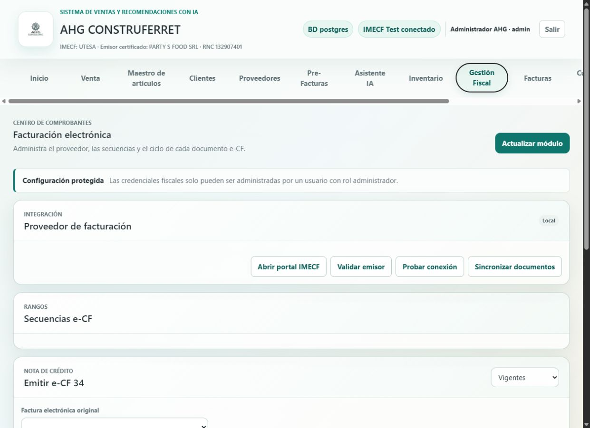

La pantalla muestra salud, secuencias, proveedor, documentos y notas de crédito.

### Consultar documentos

1. Abre **Gestión Fiscal**.
2. Filtra por estado o e-NCF.
3. Usa **Consultar estado** para actualizar el resultado remoto.
4. Usa **Tracking** para consultar el seguimiento DGII.
5. Descarga el XML firmado cuando esté disponible.

### Emitir una nota de crédito e-CF 34

1. Selecciona la factura original aceptada.
2. Elige el código de modificación.
3. Escribe el motivo de la devolución o corrección.
4. Revisa el vencimiento calculado.
5. Pulsa **Emitir E34**.
6. Confirma que IMECF devuelva estado aceptado.

### Configurar empresa fiscal

Solo un administrador con permiso fiscal puede guardar credenciales. El flujo es: guardar empresa -> validar emisor -> probar conexión -> activar.

No publiques claves IMECF en capturas, manuales o GitHub.

## 12. Facturas y comprobantes

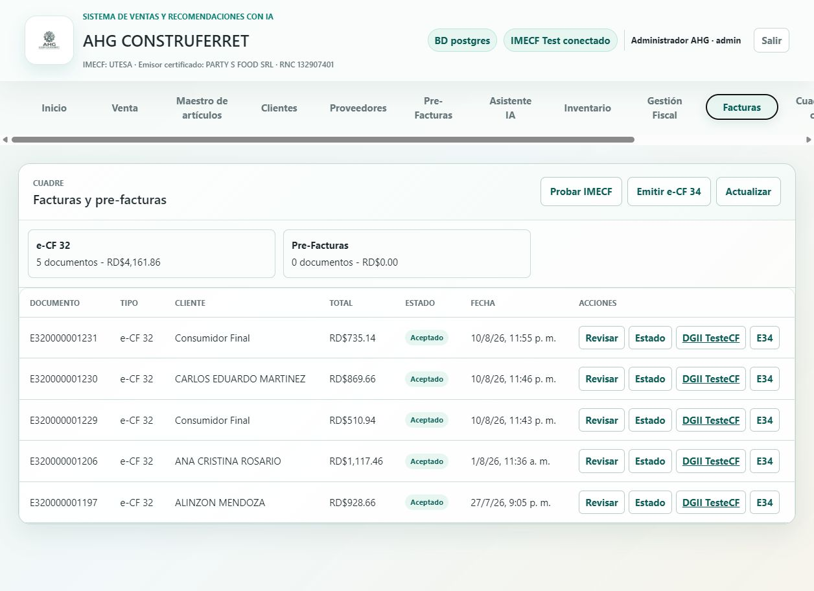

1. Abre **Facturas**.
2. Busca por e-NCF, cliente o referencia.
3. Pulsa **Revisar** para abrir el comprobante.
4. Verifica emisor, comprador, líneas, descuentos, ITBIS, forma de pago y total.
5. Usa la consulta DGII o el QR disponible.
6. Consulta estado, tracking o XML cuando la integración lo permita.
7. Imprime o entrega el documento generado.

En pagos mixtos, la vista previa muestra cada medio y su importe. Las notas de crédito aparecen como una forma de pago independiente.

## 13. Cuadre de caja

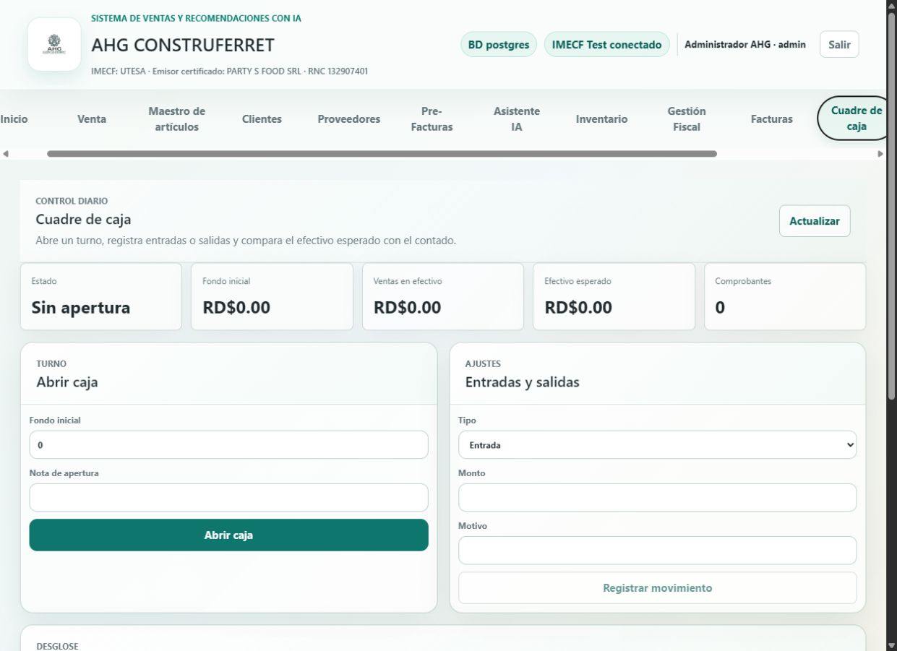

### Abrir turno

1. Abre **Cuadre de caja**.
2. Escribe el fondo inicial.
3. Agrega una nota de apertura si es necesaria.
4. Pulsa **Abrir caja**.

### Durante el turno

- Registra una **Entrada** para dinero que entra sin factura.
- Registra una **Salida** para gastos o retiros.
- Escribe siempre el motivo.
- Revisa el desglose por efectivo, tarjeta, transferencia, PayPal y nota de crédito.

### Cerrar

1. Cuenta el efectivo físico.
2. Escribe el efectivo contado.
3. Agrega la observación de cierre.
4. Pulsa **Cerrar y cuadrar**.
5. Revisa esperado, contado y diferencia.

## 14. Auditoría

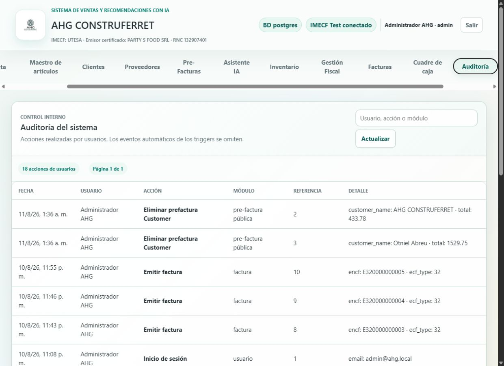

Auditoría muestra solamente acciones asociadas a usuarios: inicio de sesión, creación o modificación, ventas, movimientos y eliminaciones. Los eventos automáticos de triggers no se muestran.

Usa el buscador para filtrar por usuario, acción, módulo o referencia. La información incluye fecha, usuario, acción, entidad y detalle.

## 15. Administración y permisos

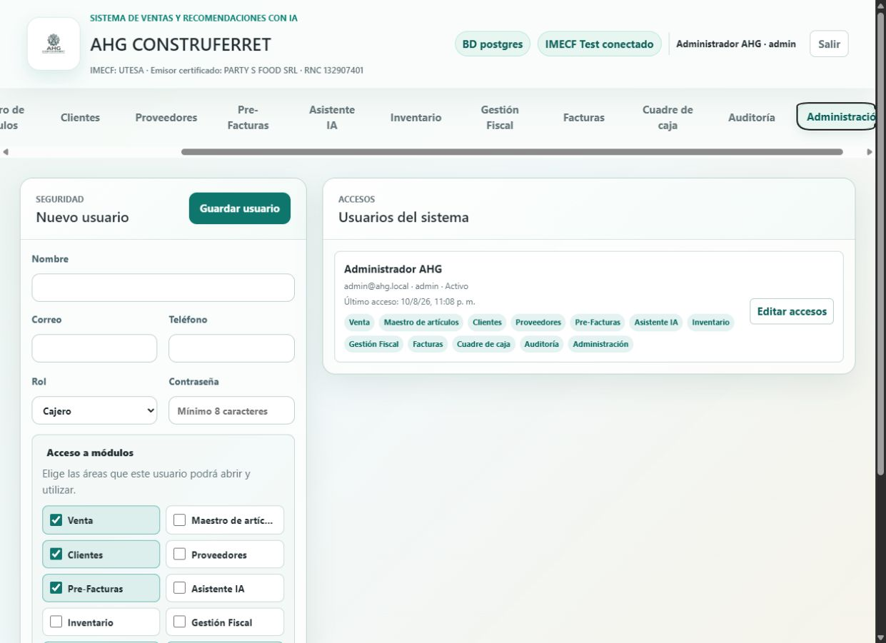

### Crear usuario

1. Abre **Administración**.
2. Completa nombre, correo, teléfono, rol y contraseña inicial.
3. Marca los módulos que podrá utilizar.
4. Mantén **Usuario activo** marcado.
5. Pulsa **Guardar usuario**.

### Modificar acceso

1. Busca el usuario en la lista.
2. Pulsa **Editar accesos**.
3. Marca o desmarca módulos.
4. Guarda los cambios.

Los módulos no autorizados desaparecen del menú y también quedan bloqueados en la API. El administrador conserva acceso completo.

**Descargar backup** genera un respaldo JSON de las tablas. Guárdalo en una ubicación protegida.

## 16. Portal Customer - preordenar productos

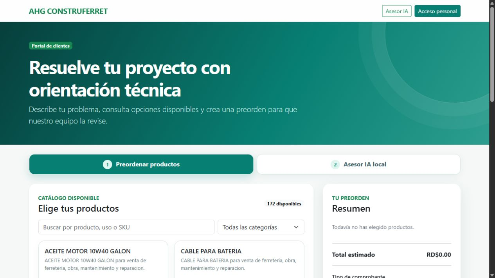

1. Abre `/catalog`.
2. En **Preordenar productos**, busca por nombre, uso o SKU.
3. Filtra por categoría si es necesario.
4. Pulsa **Agregar a prefactura**.
5. Revisa cantidades y total estimado.
6. Selecciona e-CF 32 o e-CF 31.
7. Completa nombre y teléfono.
8. Agrega correo si deseas recibir confirmación.
9. El motivo o comentario es opcional.
10. Pulsa **Enviar prefactura al negocio**.

La confirmación por correo incluye el número de solicitud cuando el servicio de correo está configurado.

## 17. Portal Customer - Asesor IA

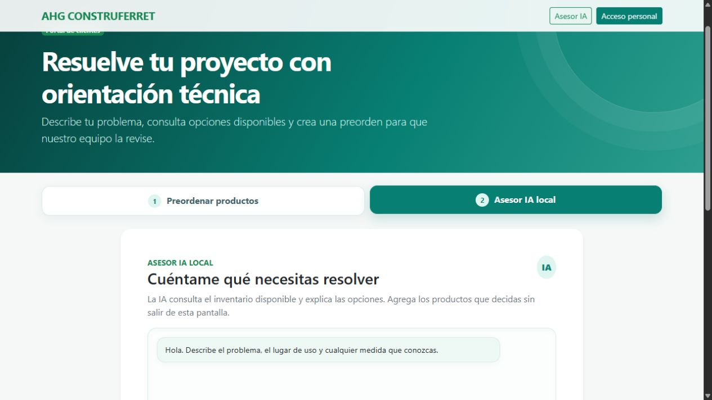

1. Selecciona la pestaña **Asesor IA local**.
2. Describe el problema con medidas y material.
3. Envía la consulta y responde los filtros técnicos.
4. Revisa productos recomendados y complementos.
5. Agrega los artículos elegidos a la preorden.
6. Regresa al resumen y envía la solicitud.

El asesor no modifica inventario ni emite facturas.

## 18. Flujo diario recomendado

1. Inicia sesión y revisa el dashboard.
2. Abre caja si corresponde.
3. Atiende solicitudes Customer y pre-facturas pendientes.
4. Revisa stock crítico.
5. Procesa ventas y pagos.
6. Consulta notas vigentes antes de aceptar un vale.
7. Revisa documentos fiscales por atender.
8. Verifica facturas y estados.
9. Cierra y cuadra la caja.
10. Revisa Auditoría y genera respaldo cuando corresponda.

## 19. Solución de problemas

- **No aparece un módulo:** el administrador debe habilitarlo para tu usuario.
- **No aparece una solicitud Customer:** pulsa **Actualizar** y confirma que portal y POS usan la misma base.
- **No llega el correo:** verifica dirección, carpeta de spam y configuración Resend/SMTP.
- **No se puede usar una nota:** confirma que está aceptada, vigente, con saldo y que seleccionaste cliente.
- **Pagos no cuadran:** los medios deben sumar exactamente el monto restante.
- **La tarjeta o PayPal no permite emitir:** completa primero la pasarela de prueba por el monto indicado.
- **No se puede emitir e-CF 31:** consulta y completa RNC o cédula y datos fiscales.
- **IMECF sin configurar:** revisa empresa activa, validación, prueba de conexión y credenciales.
- **Documento rechazado:** abre Gestión Fiscal y revisa el diagnóstico del proveedor.
- **Caja con diferencia:** revisa movimientos, efectivo inicial, pagos registrados y conteo físico.

## 20. Seguridad

Al eliminar un cliente o proveedor, escribe tu propia contraseña de acceso. El código fijo anterior ya no se utiliza. Después de cinco intentos fallidos de inicio de sesión, el acceso queda bloqueado durante 15 minutos.

### Reporte gerencial y recuperación de integraciones

1. Abre **Facturas** y define las fechas en **Rendimiento del negocio**.
2. Pulsa **Consultar** para revisar ventas, comprobantes, margen estimado, ITBIS, descuentos, notas de crédito, formas de pago y productos principales.
3. En **Gestión Fiscal**, pulsa **Reintentar pendientes** cuando un correo o envío IMECF haya fallado temporalmente.
4. Revisa el resultado mostrado y actualiza el módulo fiscal.

Cada usuario de caja puede abrir su propio turno. Identifica la terminal al abrirla; solamente ese usuario puede registrar movimientos y cerrar su caja.

- No compartas contraseñas ni claves de aplicaciones.
- Cierra sesión en equipos compartidos.
- Asigna a cada usuario solamente los módulos necesarios.
- Revisa Auditoría periódicamente.
- No publiques claves IMECF, `DATABASE_URL` ni secretos de correo.
- Conserva respaldos y controla quién puede descargarlos.
