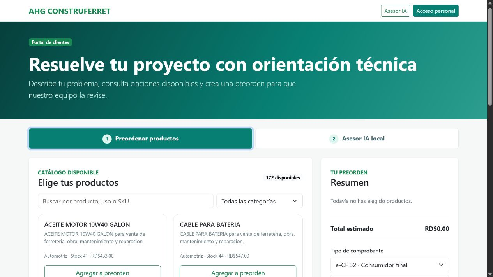
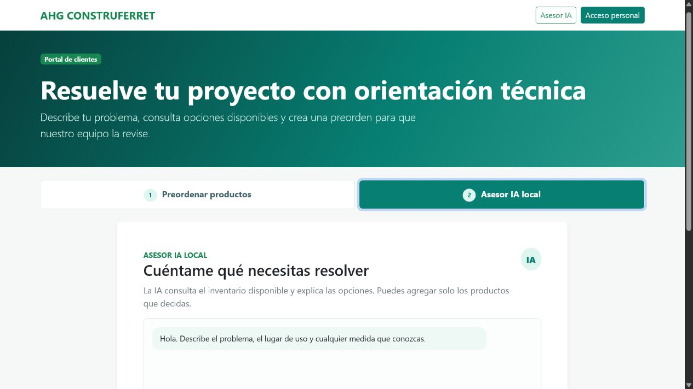

# Manual de usuario - AHG CONSTRUFERRET POS

Version 1.0 - julio de 2026

## Guia visual del sistema

Las siguientes capturas corresponden a la instalacion local documentada. Los datos visibles son datos de demostracion; en produccion se deben utilizar los datos reales del negocio.

### 1. Venta y pre-factura

En la barra superior, **Salir** cierra la sesion. La navegacion abre cada modulo: **Venta**, **Maestro de articulos**, **Clientes**, **Proveedores**, **Pre-Facturas**, **Asistente IA**, **Inventario**, **Gestion Fiscal** y **Facturas**.

En **Preordenes recibidas**, **Actualizar** vuelve a consultar las solicitudes del portal y **Cargar en ventas** copia una preorden pendiente al formulario de venta. En **Articulos**, el buscador filtra por codigo, nombre o problema; el boton **+** agrega una unidad al carrito. **Anterior** y **Siguiente** cambian la pagina de resultados.

En **Pre-Factura**, **x** limpia el carrito; **e-CF 32** selecciona consumidor final y **e-CF 31** credito fiscal. **Consultar** verifica un RNC o cedula. Los campos de cliente, pago, nota y descuento completan la operacion. **Guardar pre-factura** crea una solicitud pendiente y **Emitir comprobante** intenta generar el e-CF despues de validar los datos.

### 2. Maestro de articulos

El formulario **Nuevo articulo** crea o actualiza un producto. **Guardar articulo** almacena SKU, codigo de barras, categoria, descripcion, costo, precio, ITBIS, stock y minimo. El buscador localiza registros. En cada tarjeta, **Editar** carga los datos en el formulario y **Desactivar** conserva el historial sin permitir nuevas ventas.

### 3. Clientes

**Consultar RNC/Cedula** busca los datos fiscales del cliente. **Guardar cliente** registra nombre, identificacion, telefono, correo, direccion, actividad y notas. La casilla **Cliente activo** controla si puede utilizarse en ventas. En el directorio, **Editar** modifica el registro, **Eliminar** lo retira cuando no existe historial dependiente y **Usar en venta** lo selecciona para una pre-factura.

### 4. Proveedores

**Guardar proveedor** registra razon social, RNC, contacto, telefono, correo, direccion y notas. El buscador filtra el directorio. **Editar** modifica los datos y **Eliminar** quita un proveedor que ya no se utiliza. Este modulo sirve como referencia administrativa para compras y abastecimiento.

### 5. Pre-facturas recibidas

El buscador y los filtros permiten encontrar solicitudes por estado, cliente o fecha. **Actualizar** consulta el servidor. **Abrir** muestra productos, cantidades, precio, comprobante y datos del cliente. **Cargar en ventas** pasa la solicitud al mostrador para revisarla. **Confirmar** marca la solicitud como aceptada y **Rechazar** la cierra indicando el motivo. **Anterior** y **Siguiente** recorren las paginas.

### 6. Asistente IA local

Escribe una necesidad en el campo de consulta y pulsa **Analizar necesidad**. El asistente identifica el tipo de trabajo, solicita filtros cuando faltan medidas o caracteristicas y consulta solo articulos disponibles. **Nueva consulta** limpia la conversacion. En cada recomendacion, **Agregar** envia el producto al carrito y **Ver articulo** muestra su ficha. La IA es local y no depende de tokens externos; sus recomendaciones no sustituyen la validacion tecnica del vendedor.

### 7. Inventario

El buscador localiza productos y **Stock critico** muestra los que estan por debajo del minimo. **Entrada** registra recepcion, **Salida** registra ajuste o merma y **Ajustar** corrige una existencia con motivo. **Anterior** y **Siguiente** controlan la paginacion. Todo movimiento debe conservar una observacion para auditoria.

### 8. Gestion fiscal e IMECF

**Nueva empresa** crea una configuracion fiscal. **Guardar empresa** almacena workspace, RNC, razon social, ambiente, URL y credenciales cifradas. **Validar empresa** comprueba que el RNC y el nombre coincidan. **Probar conexion** verifica IMECF sin emitir. **Activar** selecciona la empresa para facturacion. Nunca se deben pegar API keys en el manual, capturas publicas o repositorios.

### 9. Facturas y tracking

El buscador y los filtros consultan facturas por numero, cliente, estado o fecha. **Abrir** muestra el detalle y XML disponible. **Consultar estado** actualiza el estado remoto en IMECF. **Descargar XML**, **Descargar PDF** y **Imprimir** entregan los documentos al cliente. **Ver tracking** muestra el token o identificador de seguimiento y el resultado de la consulta. La paginacion evita cargar todo el historial en una sola pantalla.

### 10. Portal cliente: preordenar productos

La cabecera contiene **AHG CONSTRUFERRET** para volver al inicio, **Asesor IA** para cambiar a la orientacion tecnica y **Acceso personal** para entrar al POS. En **Buscar por producto, uso o SKU** se filtran resultados y el selector de categoria reduce la lista. **Agregar a preorden** incorpora una cantidad; **Anterior** y **Siguiente** cambian la pagina.

En **Resumen**, el cliente selecciona e-CF 32 o e-CF 31, completa nombre, telefono, correo y el problema que desea resolver. **Enviar preorden al negocio** manda la solicitud para que aparezca en **Preordenes recibidas** del POS. La preorden no descuenta inventario ni emite factura hasta ser revisada.

### 11. Portal cliente: asesor IA local

En **Asesor IA local**, el cliente describe su problema. El asistente hace preguntas de filtro sobre tipo, medida, diametro, color, presentacion o uso cuando son necesarios. **Enviar respuesta** avanza la entrevista y **Nueva consulta** reinicia el caso. Las tarjetas recomendadas muestran descripcion, disponibilidad y uso sugerido; **Agregar a preorden** incorpora solo lo que el cliente confirma. El flujo finaliza enviando la preorden al negocio.

### 12. Flujo completo recomendado

1. El cliente consulta el catalogo o conversa con el asesor IA local.
2. Selecciona productos y envia la preorden con sus datos.
3. El vendedor abre **Pre-Facturas** y pulsa **Cargar en ventas**.
4. Se revisan existencia, precio, cantidades, tipo de e-CF y datos fiscales.
5. Se valida el RNC cuando corresponde y se emite el comprobante.
6. Se entrega el e-NCF, XML, PDF y token de tracking.

## 1. Inicio de sesion

Abre el POS, escribe correo o telefono y contrasena. La barra superior muestra usuario y rol. Pulsa **Salir** para cerrar sesion.

Permisos principales: `admin` gestiona fiscalidad; `gerente` y `almacen` gestionan productos e inventario; `cajero` y `vendedor` trabajan con clientes, pre-facturas y ventas segun permisos.

## 2. Venta y pre-factura

En **Venta**, busca por nombre, SKU, codigo de barras o necesidad escrita. Revisa precio, ITBIS y existencia; agrega productos; ajusta cantidades y descuentos; selecciona comprobante, cliente y pago; finalmente pulsa **Guardar pre-factura**.

Una pre-factura es una solicitud pendiente. Debe revisarse antes de emitir y no sustituye un comprobante fiscal.

## 3. Comprobantes fiscales

**e-CF 32 - consumidor final:** se usa para consumidor final y permite dejar datos fiscales vacios cuando no son requeridos.

**e-CF 31 - credito fiscal:** se usa cuando el comprador necesita comprobante fiscal. El RNC o cedula debe consultarse y los datos deben estar completos.

Para validar un comprador: selecciona cliente, escribe RNC/cedula, pulsa **Consultar**, verifica el nombre y confirma telefono, correo y direccion. No emitas si el RNC no corresponde.

## 4. Pre-Facturas

En **Pre-Facturas** consulta solicitudes recibidas, abre una pre-factura, verifica productos, existencias, precios, cliente, tipo de e-CF y pago, y emite cuando el negocio la apruebe. Usa los controles de paginacion para recorrer listas grandes.

Flujo: abrir -> revisar -> confirmar -> emitir -> entregar e-NCF y confirmacion.

## 5. Maestro de articulos

En **Maestro de articulos** administra SKU, codigo de barras, nombre, categoria, descripcion tecnica, costo, precio, ITBIS, stock, stock minimo, etiquetas y estado activo.

Para crear: pulsa **Nuevo articulo**, completa los campos, revisa precio e impuesto y pulsa **Guardar articulo**. Para descontinuar, usa estado inactivo en lugar de borrar para conservar historial.

## 6. Inventario

En **Inventario** revisa existencias y movimientos. **Stock critico** muestra productos por debajo del minimo.

Para ajustar: selecciona articulo, escribe cantidad o diferencia, indica motivo, guarda y verifica el movimiento. Realiza conteos fisicos periodicos.

## 7. Clientes y proveedores

En **Clientes** y **Proveedores** crea, edita, busca y consulta registros con paginacion. Usa RNC/cedula cuando corresponda y evita duplicados.

En clientes, la consulta fiscal puede traer nombre y datos remotos. Revisa la respuesta antes de guardarla.

## 8. Asistente IA local

El asistente funciona localmente con los productos, stock, categorias y reglas de recomendacion de la base de datos. No depende de una API de OpenAI o Gemini.

Para obtener mejores recomendaciones:

1. Abre **Asistente IA** en el POS o **Asesor IA local** en el portal.
2. Describe problema, lugar de uso y objetivo.
3. Incluye material, medidas, cantidad y presupuesto si los conoces.
4. Responde las preguntas de seguimiento.
5. Revisa compatibilidad, existencia y explicacion.
6. Agrega solo lo que decidas.

Ejemplos: `fuga en tubo de agua fria de 1/2 pulgada`; `pintura interior lavable blanca en galon`; `repisa en concreto, necesito taladro y broca`.

La IA solo recomienda articulos activos con existencia. Es orientativa; un tecnico debe validar trabajos de electricidad, gas, estructura o riesgo.

## 9. Portal de clientes

Abre `/catalog`. Tiene dos pantallas.

### Preordenar productos

Busca por producto, uso o SKU; filtra por categoria; revisa stock y precio; pulsa **Agregar**; revisa el resumen; selecciona e-CF 32 o e-CF 31; completa datos y problematica; consulta RNC/cedula si es e-CF 31; pulsa **Enviar preorden al negocio**.

La preorden queda sujeta a confirmacion de disponibilidad y precio por el negocio.

### Asesor IA local

Cambia a **Asesor IA local**, describe el problema, responde preguntas tecnicas, revisa compatibilidad y agrega productos a la seleccion. Luego continua con la preorden y envia la solicitud.

## 10. Gestion Fiscal e IMECF

En **Gestion Fiscal**, el administrador puede consultar empresa, espacio, RNC y ambiente; validar emisor en DGII; probar conexion sin emitir; activar empresa; consultar documentos; filtrar estados; consultar estado y trackId; descargar XML firmado y emitir notas e-CF 34.

Flujo obligatorio: guardar credenciales -> validar emisor -> probar conexion -> activar empresa.

## 11. Facturas, tracking y token

Una factura puede guardar ID remoto, e-NCF, estado y `trackId`.

Para demostrar tracking: emite en ambiente de prueba; abre **Facturas**; busca por e-NCF o cliente; consulta estado/tracking; muestra estado, fecha y trackId devueltos. Si el flujo genera un token publico, se consulta en `/api/public/tracking/<TOKEN>`.

No publiques API keys, cookies ni tokens reales. En una defensa academica muestra solo un token de prueba parcialmente oculto y explica que sirve para consultar estado, no para editar la factura.

## 12. Reportes y control diario

Revisa ventas del dia, pre-facturas pendientes, documentos con error, stock critico y documentos sin tracking. Usa filtros y paginacion.

## 13. Buenas practicas

- No compartas contrasenas, API keys ni la clave maestra.
- Cierra sesion en equipos compartidos.
- Revisa RNC antes de e-CF 31.
- No confundas pre-factura con factura fiscal.
- Verifica stock antes de prometer disponibilidad.
- Haz copias de seguridad.
- No cambies `AHG_CREDENTIAL_SECRET` sin plan de migracion.
- Valida tecnicamente cualquier recomendacion de IA.

## 14. Errores frecuentes

- **IMECF sin configurar:** verifica API key, empresa habilitada, validacion y prueba de conexion.
- **Credencial no se puede descifrar:** usa la misma clave maestra con la que se guardo o vuelve a guardar la credencial.
- **No hay recomendaciones:** describe medidas y material, responde filtros y verifica stock activo.
- **No puedo emitir e-CF 31:** completa y valida RNC/cedula, nombre y direccion fiscal.
- **La preorden no aparece:** pulsa **Actualizar** y confirma que portal y POS usan la misma base.

## 15. Flujo completo

Portal cliente -> IA local -> seleccion -> preorden -> revision POS -> validacion comprador -> confirmacion precio/stock -> emision e-CF -> consulta estado -> tracking y XML.
